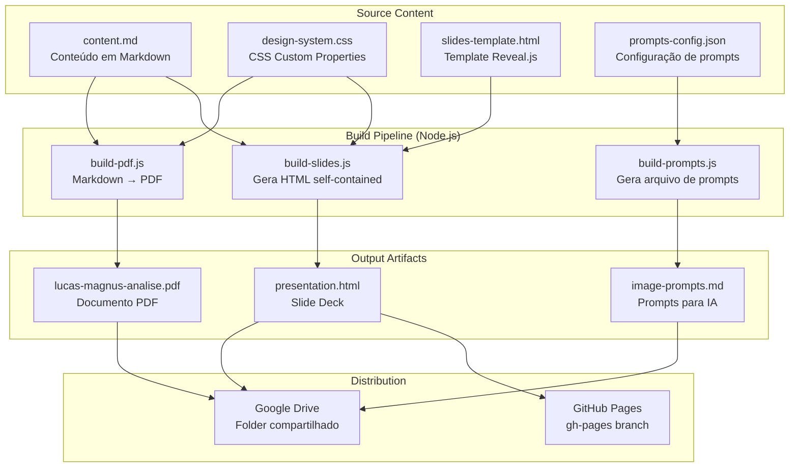
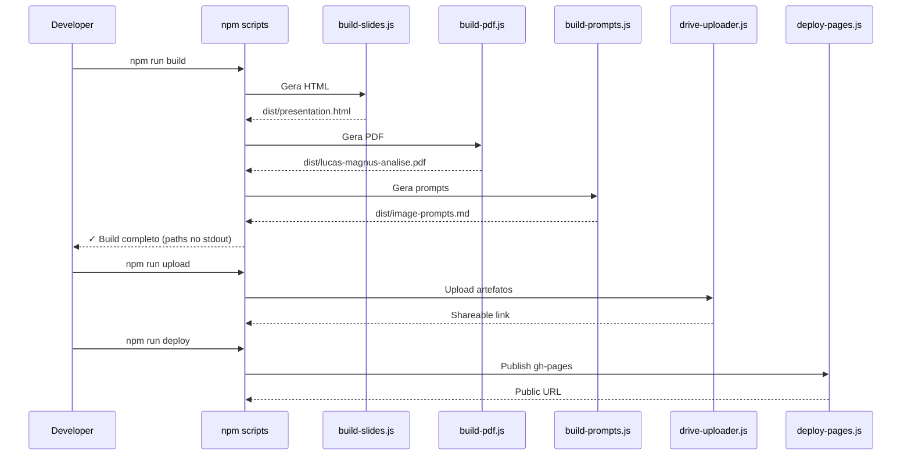

# Design Document: Lucas Magnus Presentation

## Overview

Este projeto entrega um sistema de build automatizado que produz uma apresentação interativa (Reveal.js), um documento PDF companion, prompts para geração de imagens por IA, e faz upload/deploy dos artefatos para Google Drive e GitHub Pages.

A arquitetura segue um pipeline linear: conteúdo Markdown → transformação → artefatos (HTML, PDF, prompts) → distribuição (Drive, Pages). Cada módulo é independente e orquestrado por npm scripts.

### Decisões de Design

| Decisão | Escolha | Justificativa |
|---------|---------|---------------|
| Motor de slides | Reveal.js 4.x | Self-contained HTML, suporte a vertical slides, responsivo, amplamente adotado |
| Formato fonte | Markdown | Separação conteúdo/apresentação, fácil edição, pipeline de conversão maduro |
| PDF pipeline | md-to-pdf (Puppeteer) | Suporta CSS customizado, gera PDF A4 com TOC, usa Chromium headless |
| Hosting | GitHub Pages (gh-pages branch) | Gratuito, integrado ao repo, URL pública estável |
| Drive API | googleapis + Service Account | Autenticação server-side sem OAuth interativo, ideal para automação |
| Runtime | Node.js 18+ | Ecossistema npm rico, async I/O para uploads, scripts unificados |
| Design tokens | CSS Custom Properties | Reutilizáveis entre HTML slides e PDF, single source of truth |
| Imagens IA | Prompts descritivos (Nano/Banana) | Flexível, não depende de API específica, reproduzível |

## Architecture



### Fluxo de Execução



## Components and Interfaces

### 1. Design System (`src/design-system.css`)

Arquivo CSS com custom properties que define toda a identidade visual.

```css
/* Interface: CSS Custom Properties */
:root {
  /* Paleta */
  --color-primary: #1B2A4A;      /* Deep Navy */
  --color-secondary: #C9A96E;    /* Gold/Champagne */
  --color-accent: #722F37;       /* Burgundy */
  --color-neutral: #FAF8F5;      /* Cream/Off-white */
  --color-text: #2C2C2C;         /* Dark text */
  --color-text-light: #F5F5F0;   /* Light text on dark bg */

  /* Tipografia */
  --font-heading: 'Playfair Display', serif;
  --font-body: 'Inter', sans-serif;
  --font-weight-heading: 700;
  --font-weight-body: 400;
  --font-weight-bold: 600;
  --font-size-h1: 48px;
  --font-size-h2: 36px;
  --font-size-h3: 28px;
  --font-size-h4: 24px;
  --font-size-body: 16px;
  --font-size-small: 14px;
  --font-size-large: 18px;

  /* Espaçamento */
  --space-xs: 4px;
  --space-sm: 8px;
  --space-md: 16px;
  --space-lg: 32px;
  --space-xl: 64px;
  --space-2xl: 128px;

  /* Bordas */
  --border-thin: 1px solid var(--color-secondary);
  --border-accent: 2px solid var(--color-accent);

  /* Sombras */
  --shadow-subtle: 0 2px 8px rgba(27, 42, 74, 0.08);
  --shadow-elevated: 0 8px 32px rgba(27, 42, 74, 0.16);

  /* Transições */
  --transition-default: 400ms ease;
}
```

### 2. Presentation Engine (`src/build-slides.js`)

**Responsabilidade:** Gera o HTML self-contained com Reveal.js.

```typescript
// Interface conceitual
interface SlideBuilder {
  loadContent(markdownPath: string): ContentSections;
  applyDesignSystem(cssPath: string): void;
  generateSlides(sections: ContentSections): string; // HTML completo
  inlineAssets(html: string): string; // Inlines CSS/JS/fonts
  validateCompliance(html: string): ComplianceReport;
  write(outputPath: string): void;
}

interface ContentSections {
  abertura: SlideContent[];
  etimologia: SlideContent[];
  internacionalizacao: SlideContent[];
  brandingPessoal: SlideContent[];
  simbolismoSonoro: SlideContent[];
  presencaDigital: SlideContent[];
  visaoFuturo: SlideContent[];
  celebracao: SlideContent[];
}

interface SlideContent {
  title: string;
  body: string;        // Markdown content
  notes?: string;      // Speaker notes
  vertical?: boolean;  // Sub-slide (vertical stack)
  image?: string;      // Visual asset reference
}

interface ComplianceReport {
  compliant: boolean;
  violations: Array<{
    element: string;
    property: string;
    value: string;
    expected: string;
  }>;
}
```

### 3. PDF Generator (`src/build-pdf.js`)

**Responsabilidade:** Converte Markdown em PDF estilizado.

```typescript
interface PdfGenerator {
  loadMarkdown(path: string): string;
  applyStyles(cssPath: string): void;
  setCoverPage(config: CoverConfig): void;
  generateToc(): TableOfContents;
  render(options: PdfOptions): Buffer;
  write(outputPath: string): void;
}

interface CoverConfig {
  title: string;       // "Lucas Magnus Schossland Bachion"
  subtitle: string;    // "Análise Estratégica de Nome e Celebração"
  date: string;        // "Dezembro 2025"
  crest: string;       // Path to LM crest SVG/PNG
}

interface PdfOptions {
  format: 'A4';
  margins: { top: 25, bottom: 25, left: 20, right: 20 }; // mm
  imageDpi: 150;
  tocEnabled: boolean;
}

interface TableOfContents {
  entries: Array<{ level: 1 | 2; title: string; page: number }>;
}
```

### 4. Image Prompt Generator (`src/build-prompts.js`)

**Responsabilidade:** Gera prompts estruturados para ferramentas de IA.

```typescript
interface PromptGenerator {
  loadConfig(configPath: string): PromptConfig[];
  generatePrompts(configs: PromptConfig[]): ImagePrompt[];
  formatOutput(prompts: ImagePrompt[]): string; // Markdown formatado
  write(outputPath: string): void;
}

interface PromptConfig {
  assetName: string;
  dimensions: { width: number; height: number };
  category: 'monogram' | 'etymology' | 'branding' | 'celebration' | 'texture';
}

interface ImagePrompt {
  assetName: string;
  dimensions: string;           // "1024x1024"
  styleKeywords: string[];      // min 5
  description: string;          // min 50 words
  negativePrompt: string[];     // min 3 items
}
```

### 5. Drive Uploader (`src/drive-uploader.js`)

**Responsabilidade:** Upload de artefatos para Google Drive.

```typescript
interface DriveUploader {
  authenticate(credentialsPath: string): Promise<void>;
  ensureFolder(folderName: string): Promise<string>; // folder ID
  uploadFile(filePath: string, folderId: string): Promise<string>; // file ID
  setPermissions(folderId: string): Promise<string>; // shareable link
}

// Configuração
interface DriveConfig {
  folderName: 'Lucas Magnus — Apresentação';
  maxTimeoutPerFile: 120_000; // ms
  maxRetries: 3;
  permissions: { type: 'anyone'; role: 'reader' };
}
```

### 6. Deployment Pipeline (`src/deploy-pages.js`)

**Responsabilidade:** Publica slides no GitHub Pages.

```typescript
interface DeployPipeline {
  prepareBuild(distPath: string): void;
  deploy(branch: string): Promise<string>; // public URL
  verifyDeployment(url: string, timeout: number): Promise<boolean>;
}

// Usa gh-pages npm package internamente
interface DeployConfig {
  branch: 'gh-pages';
  distDir: './dist';
  verifyTimeout: 60_000; // ms
}
```

### 7. Build Orchestrator (`package.json` scripts)

```json
{
  "scripts": {
    "build": "node src/build-slides.js && node src/build-pdf.js && node src/build-prompts.js",
    "upload": "node src/drive-uploader.js",
    "deploy": "node src/deploy-pages.js",
    "all": "npm run build && npm run upload && npm run deploy",
    "validate": "node src/validate-compliance.js"
  }
}
```

## Data Models

### Content Document Structure (Markdown)

```markdown
# Lucas Magnus Schossland Bachion — Análise Estratégica

## Abertura
[Introdução ao propósito do documento]

## Etimologia e Significado
### Lucas — O Luminoso
### Magnus — O Grande
### Junção: O Grande Iluminado
### Registro Civil Completo

## Internacionalização
### Presença Multilíngue
### Análise Fonética
### Aplicações Práticas

## Branding Pessoal e Posicionamento
### Efeito Prodígio
### Arquétipo: Inovador Clássico
### Domínios e Presença Digital
### Roadmap do Palestrante

## Simbolismo Sonoro (Bouba-Kiki)
### O Efeito Bouba-Kiki
### Análise de "Lucas"
### Análise de "Magnus"
### Efeito Combinado

## Presença Digital e SEO
### Análise Oceano Azul
### Estratégia de Domínios
### Táticas de Ocupação

## Visão de Futuro
### Trajetória Profissional
### Posicionamento de Longo Prazo

## Análise de Riscos
### Riscos Identificados
### Mitigações

## Celebração do Nascimento
[Seção emocional de encerramento]
```

### Prompt Configuration Schema

```json
{
  "$schema": "http://json-schema.org/draft-07/schema#",
  "type": "array",
  "items": {
    "type": "object",
    "required": ["assetName", "dimensions", "category", "styleKeywords", "description", "negativePrompt"],
    "properties": {
      "assetName": { "type": "string" },
      "dimensions": {
        "type": "object",
        "properties": {
          "width": { "type": "integer", "minimum": 512 },
          "height": { "type": "integer", "minimum": 512 }
        }
      },
      "category": {
        "type": "string",
        "enum": ["monogram", "etymology", "branding", "celebration", "texture"]
      },
      "styleKeywords": {
        "type": "array",
        "items": { "type": "string" },
        "minItems": 5
      },
      "description": { "type": "string", "minLength": 200 },
      "negativePrompt": {
        "type": "array",
        "items": { "type": "string" },
        "minItems": 3
      }
    }
  }
}
```

### Design System Token Export Format

Os tokens são exportados como CSS Custom Properties (variáveis CSS) no arquivo `src/design-system.css`. Esse arquivo é importado tanto pelo template Reveal.js quanto pelo pipeline de PDF (via Puppeteer CSS injection).

### Build Output Structure

```
dist/
├── presentation.html          # Slide deck self-contained
├── lucas-magnus-analise.pdf   # Documento PDF
├── image-prompts.md           # Prompts para IA
└── assets/
    ├── lm-crest.svg           # Monograma/brasão LM
    └── visual-assets/         # Imagens geradas (quando disponíveis)
```

### Google Drive Folder Structure

```
Lucas Magnus — Apresentação/
├── presentation.html
├── lucas-magnus-analise.pdf
├── image-prompts.md
└── visual-assets/
    └── [imagens geradas]
```

## Correctness Properties

*A property is a characteristic or behavior that should hold true across all valid executions of a system — essentially, a formal statement about what the system should do. Properties serve as the bridge between human-readable specifications and machine-verifiable correctness guarantees.*

### Property 1: Design System Compliance

*For any* slide content generated by the Presentation Engine, every CSS property value (color, font-family, font-size, spacing, border, shadow) used in the output HTML SHALL reference exclusively Design System tokens (CSS custom properties), with zero ad-hoc literal values.

**Validates: Requirements 1.4, 3.3**

### Property 2: LM Crest Presence Invariant

*For any* slide generated by the Presentation Engine, the output HTML SHALL contain the LM crest/monogram element with rendered dimensions of at least 24×24 pixels.

**Validates: Requirements 1.6**

### Property 3: Compliance Validator Detection

*For any* HTML element containing a style property value that is NOT defined in the Design System tokens, the compliance validator SHALL flag that element as non-compliant, reporting the element, property, offending value, and expected token.

**Validates: Requirements 1.7**

### Property 4: Compound Name Invariant

*For any* text segment in the Content Document, if the word "Lucas" appears (case-sensitive, as a standalone word), it SHALL always be immediately followed by "Magnus" — the standalone word "Lucas" without "Magnus" SHALL never occur.

**Validates: Requirements 2.6**

### Property 5: Missing Image Graceful Handling (PDF)

*For any* Markdown input containing image references with invalid or unreachable paths, the PDF Generator SHALL produce a valid PDF output that omits the broken image and includes placeholder text containing the missing resource's file name.

**Validates: Requirements 4.7**

### Property 6: Failed Conversion Produces No Partial Output

*For any* Markdown input that causes the PDF conversion to fail (malformed syntax, system errors), the PDF Generator SHALL NOT create any output file at the target path, and SHALL report an error message describing the failure reason.

**Validates: Requirements 4.8**

### Property 7: Drive Upload Deduplication

*For any* file upload where a file with the same name already exists in the target Google Drive folder, the Drive Uploader SHALL call the update/overwrite API instead of the create API, resulting in exactly one file with that name in the folder after the operation.

**Validates: Requirements 5.6**

### Property 8: Upload Retry and Continuation

*For any* set of files to upload where one or more files fail persistently, the Drive Uploader SHALL retry each failing file exactly 3 times, then skip it and continue uploading remaining files, and finally print to stderr a summary listing all files that failed.

**Validates: Requirements 5.7**

### Property 9: Asset Path Resolution for Subdirectory Hosting

*For any* asset reference (CSS, JS, font, image) in the generated HTML, the path SHALL be relative (not absolute) and SHALL resolve correctly when the HTML is served from a GitHub Pages subdirectory (e.g., `/repo-name/`).

**Validates: Requirements 6.3**

### Property 10: Prompt Structure Completeness

*For any* generated ImagePrompt, the output SHALL contain: a non-empty asset name, dimensions string (WxH), at least 5 style keywords, a natural-language description of at least 50 words, and a negative prompt with at least 3 items.

**Validates: Requirements 7.3**

### Property 11: Prompt Style Consistency

*For any* generated ImagePrompt, the style keywords or description SHALL include references to the "Old Money Tech" aesthetic: the terms "classic", "serif", "navy", "gold", and "elegant" (or their direct equivalents) SHALL appear consistently.

**Validates: Requirements 7.2**

### Property 12: Prompt Category Coverage with Correct Dimensions

*For any* valid prompt configuration input, the Image Prompt Generator SHALL produce at least one prompt for each required category (monogram, etymology, branding, celebration, texture ×2), and each prompt's dimensions SHALL match its category rules: 1024×1024 for monogram/crest, 1920×1080 for textures, and square or portrait for remaining assets.

**Validates: Requirements 7.1, 7.6**

### Property 13: Build Pipeline Fail-Fast Behavior

*For any* step in the build/upload/deploy sequence that throws an error, the pipeline SHALL exit with a non-zero exit code, report to stderr which step failed and the error message, and SHALL NOT execute any subsequent steps in the sequence.

**Validates: Requirements 15.5, 15.7**

## Error Handling

### Estratégia Geral

Todos os módulos seguem o padrão "fail loudly, never silently":

| Módulo | Erro | Comportamento |
|--------|------|---------------|
| build-slides.js | Markdown inválido | Exit code 1, stderr com linha/coluna do erro |
| build-slides.js | Asset não encontrado | Placeholder SVG inline, warning no stderr |
| build-pdf.js | Conversão falha | Exit code 1, stderr com razão, nenhum arquivo parcial |
| build-pdf.js | Imagem não encontrada | Omite imagem, insere texto placeholder com nome do recurso |
| build-prompts.js | Config inválido | Exit code 1, stderr com validação JSON Schema |
| drive-uploader.js | Auth falha | Exit code 1, stderr com tipo de falha de credencial |
| drive-uploader.js | Upload falha | 3 retries, skip, continua, summary no stderr |
| drive-uploader.js | Timeout (>120s) | Conta como falha, entra no retry |
| deploy-pages.js | Deploy falha | Exit code 1, stderr com step + erro do gh-pages |
| deploy-pages.js | Verificação HTTP falha | Warning no stderr (não bloqueia) |
| Orchestrator (npm run all) | Qualquer step falha | Para execução, exit code do step que falhou |

### Códigos de Saída

- `0` — Sucesso
- `1` — Erro de build (input inválido, conversão falha)
- `2` — Erro de rede/autenticação (Drive, GitHub)
- `3` — Erro de validação (compliance check falhou)

### Logging

Todos os módulos usam formato estruturado no stderr:

```json
{
  "timestamp": "2025-01-15T10:30:00Z",
  "level": "ERROR",
  "module": "build-pdf",
  "message": "Conversion failed: invalid markdown at line 42",
  "context": { "file": "content.md", "line": 42 }
}
```

## Testing Strategy

### Abordagem Dual: Unit Tests + Property Tests

Este projeto usa uma combinação de testes unitários (exemplos específicos) e testes baseados em propriedades (validação universal) para cobertura abrangente.

### Property-Based Testing

**Biblioteca:** [fast-check](https://github.com/dubzzz/fast-check) (JavaScript/TypeScript)

**Configuração:** Mínimo 100 iterações por teste de propriedade.

**Tag format:** Cada teste de propriedade inclui um comentário referenciando a propriedade do design:
```javascript
// Feature: lucas-magnus-presentation, Property 1: Design System Compliance
```

**Propriedades a implementar:**

| # | Propriedade | Módulo Testado | Gerador |
|---|-------------|----------------|---------|
| 1 | Design System Compliance | build-slides.js | Arbitrary slide content (text, headings, lists) |
| 2 | LM Crest Presence | build-slides.js | Arbitrary slide configurations |
| 3 | Compliance Validator Detection | validate-compliance.js | HTML elements with random style values (mix of valid/invalid) |
| 4 | Compound Name Invariant | content validation | Arbitrary text segments containing "Lucas" |
| 5 | Missing Image Graceful Handling | build-pdf.js | Markdown with random broken image paths |
| 6 | No Partial Output on Failure | build-pdf.js | Malformed markdown inputs |
| 7 | Drive Upload Deduplication | drive-uploader.js | Random file lists with existing/new combinations (mocked API) |
| 8 | Upload Retry and Continuation | drive-uploader.js | Random file sets with configurable failure patterns (mocked API) |
| 9 | Asset Path Resolution | build-slides.js | Random asset filenames and directory structures |
| 10 | Prompt Structure Completeness | build-prompts.js | Random prompt configurations |
| 11 | Prompt Style Consistency | build-prompts.js | Random prompt configurations |
| 12 | Category Coverage + Dimensions | build-prompts.js | Random valid prompt configs |
| 13 | Build Pipeline Fail-Fast | orchestrator | Random step failure injection |

### Unit Tests (Example-Based)

**Framework:** Vitest (compatível com o ecossistema Node.js/ESM)

**Cobertura por módulo:**

- **Design System:** Verificar tokens existem, valores hex válidos, font sizes no range
- **Content Structure:** Verificar ordem das seções, presença de keywords obrigatórias por seção
- **Slides:** Title slide tem elementos corretos, slide count 20-40, vertical sections existem
- **PDF:** Cover page tem título/subtítulo/data, TOC tem links, formato A4
- **Prompts:** Crest prompt tem termos heráldicos, dimensions por categoria
- **Deploy:** URL output format correto, error messages incluem step name

### Integration Tests

- **Build pipeline end-to-end:** `npm run build` produz todos os artefatos
- **Drive upload (mocked):** Fluxo completo com Google API mockada
- **Deploy (mocked):** Fluxo completo com gh-pages mockado
- **Responsive rendering:** Headless browser em viewport 768px

### Smoke Tests

- `package.json` tem todos os scripts definidos (build, upload, deploy, all)
- `engines.node >= 18` está especificado
- Design system CSS tem todos os tokens obrigatórios
- Reveal.js transition duration está no range 300-800ms

### Estrutura de Testes

```
tests/
├── unit/
│   ├── design-system.test.js
│   ├── content-structure.test.js
│   ├── slides-builder.test.js
│   ├── pdf-generator.test.js
│   ├── prompt-generator.test.js
│   └── deploy-pipeline.test.js
├── property/
│   ├── compliance.property.test.js      # Properties 1, 2, 3
│   ├── content.property.test.js         # Property 4
│   ├── pdf.property.test.js             # Properties 5, 6
│   ├── drive.property.test.js           # Properties 7, 8
│   ├── paths.property.test.js           # Property 9
│   ├── prompts.property.test.js         # Properties 10, 11, 12
│   └── pipeline.property.test.js        # Property 13
├── integration/
│   ├── build-pipeline.test.js
│   ├── drive-upload.test.js
│   └── deploy.test.js
└── smoke/
    └── config.test.js
```

